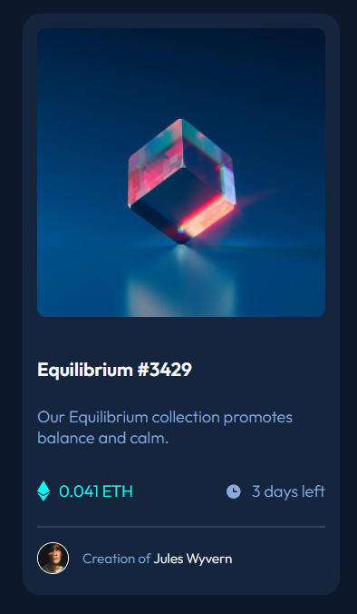

# Frontend Mentor - NFT preview card component solution

This is a solution to the [NFT preview card component challenge on Frontend Mentor](https://www.frontendmentor.io/challenges/nft-preview-card-component-SbdUL_w0U). Frontend Mentor challenges help you improve your coding skills by building realistic projects. 

## Table of contents

- [Overview](#overview)
  - [The challenge](#the-challenge)
  - [Screenshot](#screenshot)
  - [Links](#links)
- [My process](#my-process)
  - [Built with](#built-with)
  - [What I learned](#what-i-learned)
- [Author](#author)

## Overview

### The challenge

Users should be able to:

- View the optimal layout depending on their device's screen size
- See hover states for interactive elements

### Screenshot

### Links

[Solution Repo](https://github.com/billbahr/nft-preview-card-component)

[Live Site](https://billbahr.github.io/nft-preview-card-component)

## My process

### Built with

- Semantic HTML5 markup
- CSS
- Flexbox
- CSS Grid

### What I learned

I'm still learning some of the better ways to layout the page based on the design, and on trying to use semantic markup. The hover effect on the image was particularly difficult and I had to check out a bunch of other solutions to see how people had solved it before I could get it right. But, I'm more confident I could do something similar in the future now.

## Author

- Website - [Bill Bahr](https://github.com/billbahr)
- Frontend Mentor - [@billbahr](https://www.frontendmentor.io/profile/billbahr)
- Twitter - [@billbahr](https://www.twitter.com/billbahr)
